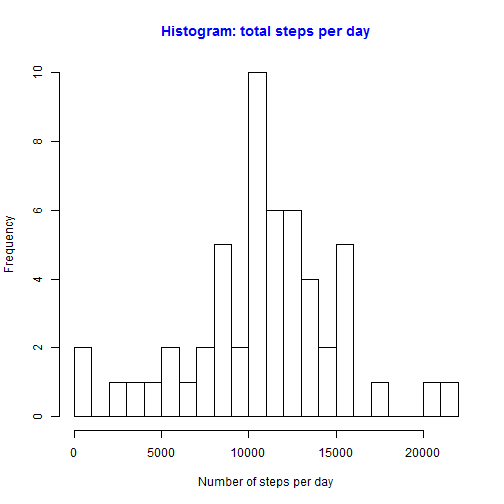
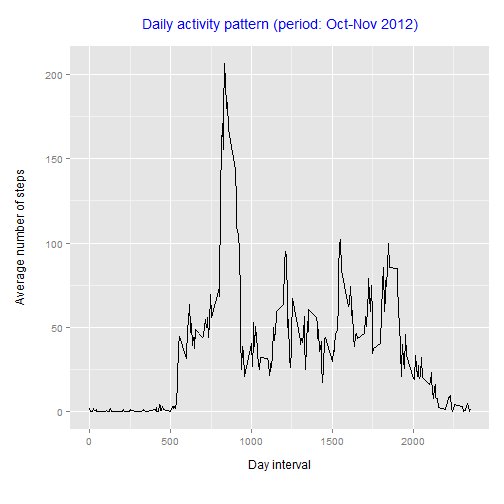
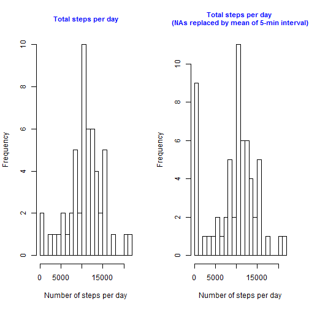
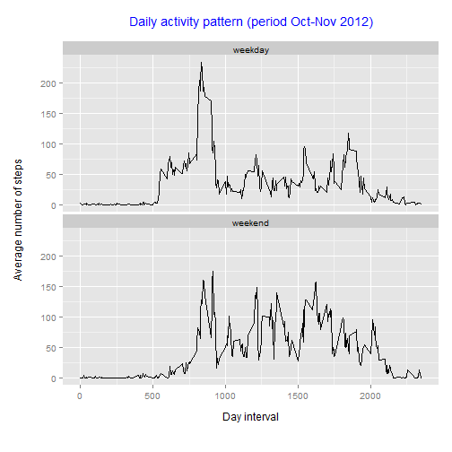

## Introduction

>"This assignment makes use of data from a personal activity monitoring device. This device collects data at 5 minute intervals through out the day. The data consists of two months of data from an anonymous individual collected during the months of October and November, 2012 and include the number of steps taken in 5 minute intervals each day."

### Data description

The variables included in this dataset are:

- steps: Number of steps taking in a 5-minute interval (missing values are coded as NA)
- date: The date on which the measurement was taken in YYYY-MM-DD format
- interval: Identifier for the 5-minute interval in which measurement was taken

The dataset is stored in a comma-separated-value (CSV) file and there are a total of 17,568 observations in this dataset.

### Loading and preprocessing the data

We assume that the zipped data file "activity.zip" is in the working directory. 

```r
# Unzipping and loading data
unzip("activity.zip" , exdir = ".")
data <- read.csv("activity.csv")
```

We need to convert the data variable from type _factor_ to type _date_.

```r
# Convert data variable 
data$date <- strptime(data$date, "%Y-%m-%d")
```

### What is mean total number of steps taken per day?

##### Make a histogram of the total number of steps taken each day


```r
# Ignore NAs
datatmp <- na.omit(data)
# Calculate total steps by day, i.e. date
library(plyr)
datapart1 <- ddply(datatmp, .(date), summarise, totalstepsbyday = sum(steps, na.rm=TRUE))
```


```r
# Show result as histogram
par(mfrow=c(1,1))
hist(datapart1$totalstepsbyday, main="Histogram: total steps per day", 
                                xlab="Number of steps per day", 
                                breaks=25, 
                                col.main="blue")
```

 

##### Calculate and report the mean and median total number of steps taken per day


```r
# Set option to not use scientific number notation
options(scipen=5)
# Calculate mean of steps by day
mymean <- mean(datapart1$totalstepsbyday)
# Calculate median of steps by day
mymedian <- median(datapart1$totalstepsbyday)
```

- mean value:     **10766.1886792**  
- median value:   **10765**

### What is the average daily activity pattern?

##### Make a time series plot of the 5-minute interval (x-axis) and the average number of steps taken, averaged across all days (y-axis)


```r
# Calculate average steps by interval
datapart2 <- ddply(data, .(interval), summarise, meanstepsbyinterval = mean(steps, na.rm=TRUE))
```


```r
# For plotting we use two libraries: ggplot and grid
library(ggplot2)
library(grid)
# Create ggplot plot
dailyactivity <- ggplot(datapart2, aes(x=interval, y=meanstepsbyinterval)) +
                        geom_line() +
                        labs(x = "Day interval", 
                             y = "Average number of steps", 
                             title = "Daily activity pattern (period: Oct-Nov 2012)") +
                        theme(plot.title = element_text(lineheight=1.2, 
                                                        vjust=2.5, 
                                                        size = rel(1.2), 
                                                        colour = "blue")) +
                        theme(axis.title.x = element_text(vjust=-1), axis.title.y = element_text(vjust=3)) +
                        theme(plot.margin = unit(c(1, 0.5, 1.5, 1), "cm"))

print(dailyactivity)
```

 

##### Which 5-minute interval, on average across all the days in the dataset, contains the maximum number of steps?


```r
# Calculate interval with maximum number of steps
maxsteps <- datapart2[which.max(datapart2$meanstepsbyinterval),]
maxstepsinterval <- maxsteps$interval
maxstepsvalue <- maxsteps$meanstepsbyinterval
```

- Interval with maximum number of steps:     **835**  
- Number of steps of interval 835:   **206.1698113**

### Imputing missing values

##### Calculate and report the total number of missing values in the dataset (i.e. the total number of rows with NAs)


```r
meansbyinterval <- datapart2
# Calculate total number of missing values
naindex <- is.na(data$steps)
result <- count(naindex)
numberofna <- result[result$x==TRUE,]$freq
```

The total number of missing values in the dataset is: **2304**.

##### Devise a strategy for filling in all of the missing values in the dataset. Create a new dataset that is equal to the original dataset but with the missing data filled in.

We replace missing values with the mean of the 5-min interval.

```r
# Create new dataset
datapart3 <- data
# Replacing NAs with mean of the 5-min interval
datapart3 <- transform(datapart3, steps = ifelse(is.na(steps), 
                                                 meansbyinterval[meansbyinterval$interval == interval,]$meanstepsbyinterval, 
                                                 steps))
```

##### Make a histogram of the total number of steps taken each day

For better comparison we show both histograms *before* and *after* imputing missing values.

```r
# Create two plots for comparison reasons
par(mfrow=c(1,2))
# Left plot without imputing missing values (see above)
hist(datapart1$totalstepsbyday, main="Total steps per day", 
                                cex.main=0.9,
                                xlab="Number of steps per day", 
                                breaks=25, 
                                col.main="blue")
# Right plot with imputing missing values
datapart31 <- ddply(datapart3, .(date), summarise, totalstepsbyday = sum(steps, na.rm=TRUE))
hist(datapart31$totalstepsbyday, main="Total steps per day \n(NAs replaced by mean of 5-min interval)", 
                                 cex.main=0.9,
                                 xlab="Number of steps per day", 
                                 breaks=25, 
                                 col.main="blue")
```

 

##### Calculate and report the mean and median total number of steps taken per day. Do these values differ from the estimates from the first part of the assignment? What is the impact of imputing missing data on the estimates of the total daily number of steps?


```r
# Calculate mean of steps by day
newmymean <- mean(datapart31$totalstepsbyday)
# Calculate median of steps by day
newmymedian <- median(datapart31$totalstepsbyday)
```


Value type    | First part values | New values       | Difference
------------- | ----------------- | ---------------- | -----------------------
mean          | 10766.1886792        | 9530.7244046    | 1235.4642747
median        | 10765      | 10439  | 326

### Are there differences in activity patterns between weekdays and weekends?

##### Create a new factor variable in the dataset with two levels -- "weekday" and "weekend" indicating whether a given date is a weekday or weekend day.


```r
# Create new dataset
datapart4 <- datapart3
# Use English as locale
Sys.setlocale("LC_ALL","C")
# Create new variable weekday variable, i.e. Monday, Tuesday, etc. 
datapart4 <- transform(datapart4, weekday = weekdays(date))
# Create new variable weekdaytype, i.e. weekday or weekend
datapart4 <- transform(datapart4, weekdaytype = ifelse(weekday == "Saturday" | weekday == "Sunday", "weekend", "weekday") )
# Factor weekdaytype variable
factor(datapart4$weekdaytype)
```

##### Make a panel plot containing a time series plot of the 5-minute interval (x-axis) and the average number of steps taken, averaged across all weekday days or weekend days (y-axis).


```r
# Calculate average steps by interval
datapart41 <- ddply(datapart4, .(weekdaytype, interval), summarise, meanstepsbyinterval = mean(steps, na.rm=TRUE))
# Create plot
dailyactivitybyweekdaytype <- ggplot(datapart41, aes(x=interval, y=meanstepsbyinterval)) +
                                    geom_line() +
                                    facet_wrap(~weekdaytype, ncol=1) +
                                    labs(x = "Day interval", 
                                         y = "Average number of steps", 
                                         title = "Daily activity pattern (period Oct-Nov 2012)") +
                                    theme(plot.title = element_text(lineheight=1.2, 
                                                                    vjust=2.5, 
                                                                    size = rel(1.2), 
                                                                    colour = "blue")) +
                                    theme(axis.title.x = element_text(vjust=-1), axis.title.y = element_text(vjust=3)) +
                                    theme(plot.margin = unit(c(1, 0.5, 1.5, 1), "cm"))
                                    
print(dailyactivitybyweekdaytype)
```

 
